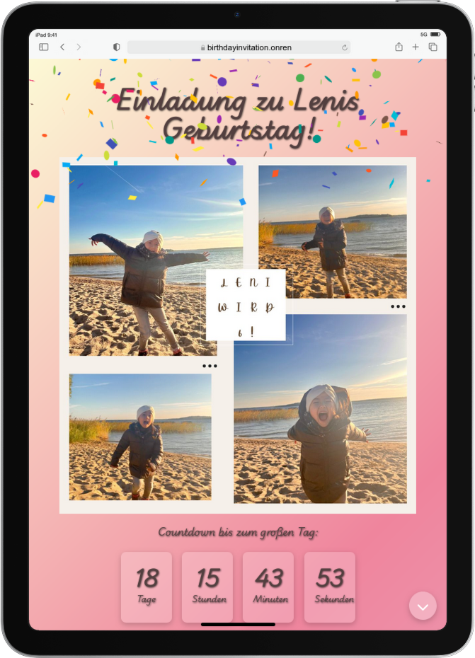

# Birthday Invitation App

The **Birthday Invitation App** is a React-based application that allows users to create and manage birthday party invitations. Guests can RSVP, view event details, and interact with the app in a dynamic and fun way. This project utilizes JavaScript with React on the frontend and integrates with a backend to store guest information.

## Features

- 🎉 **Confetti Animation**: Celebrate in style with fun confetti when the event is confirmed!
- ⏳ **Countdown Timer**: Displays a countdown to the event day to build excitement.
- 📋 **RSVP Management**: Guests can RSVP and their responses are stored locally and synced with the backend.
- 📝 **Guest List**: View, add, or remove guests from the list.
- 📦 **Backend Integration**: The app is connected to a MongoDB Atlas backend to store guest information (coming soon).

## Technologies Used

- **Frontend**: React, JavaScript, FontAwesome Icons
- **Backend**: Node.js, MongoDB Atlas
- **API Integration**: Axios for making API requests

